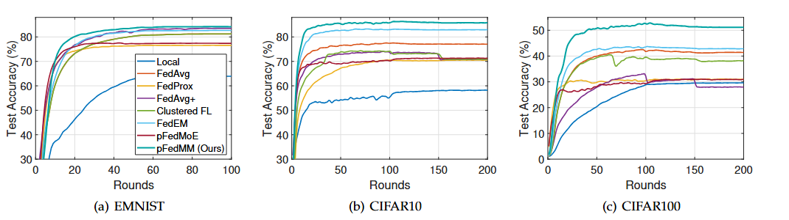

# Mixture of Experts for Personalized Federated Learning under Mixture Data Distributions in Edge Computing Networks

This repository is the official implementation of [Mixture of Experts for Personalized Federated Learning under Mixture Data Distributions in Edge Computing Networks]

Personalized federated learning (PFL) is essential for edge computing networks with heterogeneous clients.
In practice, client data exhibit complex and non-stationary input distributions with marginal drift, and many clients participate intermittently or may be absent due to network instability and resource constraints.
Existing approaches mainly focus on conditional distribution personalization, while ignoring marginal drift and intermittent participation.
In this paper, we model each client’s data as a mixture of shared latent base distributions, reducing personalization to learning conditional predictors and client-specific mixture weights.
We adopt a lightweight mixture of experts (MoE) model with a shared backbone and multiple expert heads, where each expert captures a base-wise conditional distribution, shared batch normalization mitigates marginal distribution shift, and the PFL objective becomes a linear mixture maximum likelihood.
Furthermore, we propose a PFL algorithm via MoE under mixture data distributions (\textit{pFedMM}) which incorporates prior information to jointly update model parameters and mixture weights. \textit{pFedMM} enables personalization for absent clients through one step mixture weight evaluation without additional training.
Extensive experiments demonstrate that pFedMM improves accuracy by about 8.8\% over baselines, achieves up to 5.8\% gains for unseen clients, and exhibits larger advantages on more complex datasets. Our code is available at \url{https://github.com/Archipes/pFedMM}.

## Requirements

To install requirements:

```setup
pip install -r requirements.txt
```

## Usage

We provide code to simulate federated training of machine learning. 
The core objects are `Aggregator` and `Client`, different federated learning
algorithms can be implemented by revising the local update method 
`Client.step()` and/or the aggregation protocol defined in
`Aggregator.mix()` and `Aggregator.update_client()`.

In addition to the trivial baseline consisting of training models locally without
any collaboration, this repository supports the following federated learning
algorithms:

* FedAvg ([McMahan et al. 2017](http://proceedings.mlr.press/v54/mcmahan17a.html))
* FdProx ([Li et al. 2018](https://arxiv.org/abs/1812.06127))
* Clustered FL ([Sattler et al. 2019](https://ieeexplore.ieee.org/abstract/document/9174890))
* pFedMe ([Dinh et al. 2020](https://proceedings.neurips.cc/paper/2020/file/f4f1f13c8289ac1b1ee0ff176b56fc60-Paper.pdf))
* L2SGD ([Hanzely et al. 2020](https://proceedings.neurips.cc/paper/2020/file/187acf7982f3c169b3075132380986e4-Paper.pdf))
* APFL ([Deng et al. 2020](https://arxiv.org/abs/2003.13461))
* q-FFL ([Li et al. 2020](https://openreview.net/forum?id=ByexElSYDr))
* AFL ([Mohri et al. 2019](http://proceedings.mlr.press/v97/mohri19a.html))
* FedEN ([Marfoq et al. 2021](https://proceedings.neurips.cc/paper_files/paper/2021/file/82599a4ec94aca066873c99b4c741ed8-Paper.pdf))
* pFedMoE ([Li et al. 2026 ](https://ieeexplore.ieee.org/stamp/stamp.jsp?tp=&arnumber=11359536))

## Datasets

We provide five federated benchmark datasets spanning a wide range
of machine learning tasks: image classification (CIFAR10 and CIFAR100),
handwritten character recognition (EMNIST and FEMNIST), and language
modelling (Shakespeare), in addition to a synthetic dataset

Shakespeare dataset (resp. FEMNIST) was naturally partitioned by assigning
all lines from the same characters (resp. all images from the same writer)
to the same client.  We created federated versions of CIFAR10 and EMNIST by
distributing samples with the same label across the clients according to a 
symmetric Dirichlet distribution with parameter 0.4. For CIFAR100,
we exploited the availability of "coarse" and "fine" labels, using a two-stage
Pachinko allocation method  to assign 600 sample to each of the 100 clients.

The following table summarizes the datasets and models

|Dataset         | Task |  Model |
| ------------------  |  ------|------- |
| FEMNIST   |     Handwritten character recognition       |     2-layer CNN + 2-layer FFN  |
| EMNIST    |    Handwritten character recognition     |      2-layer CNN + 2-layer FFN     |
| CIFAR10   |     Image classification        |      MobileNet-v2 |
| CIFAR100    |     Image classification         |      MobileNet-v2  |
| Shakespeare |     Next character prediction        |      Stacked LSTM    |
| Synthetic dataset| Binary classification | Linear model | 

See the `README.md` files of respective dataset, i.e., `data/$DATASET`,
for instructions on generating data

## Training

Run on one dataset, with a specific  choice of federated learning method.
Specify the name of the dataset (experiment), the used method, and configure all other
hyper-parameters (see all hyper-parameters values in the appendix of the paper)

```train
python3  python run_experiment.py cifar10 FedAvg \
    --n_learners 1 \
    --n_rounds 200 \
    --bz 128 \
    --lr 0.01 \
    --lr_scheduler multi_step \
    --log_freq 5 \
    --device cuda \
    --optimizer sgd \
    --seed 1234 \
    --logs_root ./logs \
    --verbose 1
```

The test and training accuracy and loss will be saved in the specified log path.

We provide example scripts to run paper experiments under `paper_experiments/` directory.

## Evaluation

We give instructions to run experiments on CIFAR-10 dataset as an example
(the same holds for the other datasets). You need first to go to 
`./data/cifar10`, follow the instructions in `README.md` to download and partition
the dataset.

All experiments will generate tensorboard log files (`logs/cifar10`) that you can 
interact with, using [TensorBoard](https://www.tensorflow.org/tensorboard)

### Average performance of personalized models

Run the following scripts, this will generate tensorboard logs that you can interact with to make plots or get the
values presented in Table 2

```eval
# run FedAvg
echo "Run FedAvg"
python run_experiment.py cifar10 FedAvg --n_learners 1 --n_rounds 200 --bz 128 --lr 0.01 \
 --lr_scheduler multi_step --log_freq 5 --device cuda --optimizer sgd --seed 1234 --verbose 1

# run FedAvg + local adaption
echo "run FedAvg + local adaption"
python run_experiment.py cifar10 FedAvg --n_learners 1 --locally_tune_clients --n_rounds 201 --bz 128 \
 --lr 0.001 --lr_scheduler multi_step --log_freq 10 --device cuda --optimizer sgd --seed 1234 --verbose 1

# run training using local data only
echo "Run Local"
python run_experiment.py cifar10 local --n_learners 1 --n_rounds 201 --bz 128 --lr 0.03 \
 --lr_scheduler multi_step --log_freq 10 --device cuda --optimizer sgd --seed 1234 --verbose 1

# run Clustered FL
echo "Run Clustered FL"
python run_experiment.py cifar10 clustered --n_learners 1 --n_rounds 201 --bz 128 --lr 0.003 \
 --lr_scheduler multi_step --log_freq 10 --device cuda --optimizer sgd --seed 1234 --verbose 1

# run FedProx
echo "Run FedProx"
python run_experiment.py cifar10 FedProx --n_learners 1 --n_rounds 201 --bz 128 --lr 0.01 --mu 1.0\
 --lr_scheduler multi_step --log_freq 10 --device cuda --optimizer prox_sgd --seed 1234 --verbose 1

# Run pFedME
echo "Run "
python run_experiment.py cifar10 pFedMe --n_learners 1 --n_rounds 201 --bz 128 --lr 0.001 --mu 1.0 \
 --lr_scheduler multi_step --log_freq 10 --device cuda --optimizer prox_sgd --seed 1234 --verbose 1

# run FedEM
echo "Run FedEM"
python run_experiment.py cifar10 FedEM --n_learners 3 --n_rounds 201 --bz 128 --lr 0.03 \
 --lr_scheduler multi_step --log_freq 10 --device cuda --optimizer sgd --seed 1234 --verbose 1

# run pFedMoE
echo "Run pFedMoE"
python run_experiment.py cifar10 pFedMoE --n_learners 2 --n_tasks 80 --n_rounds 200 --bz 128 --lr 0.03 \
 --lr_scheduler multi_step --log_freq 1 --device cuda --optimizer sgd --seed 1234 --verbose 1

# run pFedMM
echo "Run pFedMM"
python run_experiment.py cifar10 pFedMM --n_learners 3 --n_tasks 80 --n_rounds 200 --bz 128 --lr 0.03 \
 --lr_scheduler multi_step --log_freq 1 --device cuda --optimizer sgd --seed 1234 --verbose 1
```

Similar for other datasets are provided in `papers_experiments/`

### Effect of M 
Run the following scripts to get the logs corresponding to different choices for 
the parameter M (here we ive an example with M=3)

```effect_of_M
# run FedEM

echo "Run FedEM | M=4"
python run_experiment.py cifar10 pFedMM \
    --n_learners 3 \
    --n_tasks 80
    --n_rounds 201 \
    --bz 128 --lr 0.03 \
    --lr_scheduler multi_step \
    --log_freq 10  \
    --device cuda \
    --optimizer sgd \
    --seed 1234 \
    --verbose 1
```

### Generalization to unseen clients

You need to run the same script as in the previous section. Make sure that `--test-clients-frac` is non-zero,
when you call `generate_data.py`.

### Clients sampling

Our code gives the possibility to use only a fraction of the available clients at each round,
you can specify this  parameter when running `run_experiment.py` using the argument `--sampling_rate` (default is `0`). 

### Fully-decentralized federated learning

To simulate a fully-decentralized training you need to specify `--decentralized` when you run `run_experiment.py`

## Results

The  performance of each personalized model is evaluated on the local test dataset
(unseen at training). The following shows the average weighted accuracy with 
weights proportional to local dataset sizes. We observe that pFedMM obtains 
the best performance across all datasets.

| Method            | EMNIST (All / Bottom-10%) | CIFAR-10 (All / Bottom-10%) | CIFAR-100 (All / Bottom-10%) |
| ----------------- | ------------------------- | --------------------------- | ---------------------------- |
| Local             | 64.0 / 47.6               | 58.3 / 38.5                 | 30.6 / 19.8                  |
| FedAvg            | 81.2 / 69.2               | 77.7 / 72.1                 | 42.7 / 36.0                  |
| FedProx           | 76.6 / 66.6               | 70.7 / 58.0                 | 31.5 / 20.9                  |
| FedAvg+           | 83.6 / **78.4**           | 74.1 / 61.6                 | 33.6 / 25.8                  |
| Clustered FL      | 81.3 / 69.3               | 74.5 / 66.4                 | 40.7 / 34.3                  |
| pFedMe            | 83.3 / 76.4               | 81.7 / 73.6                 | 41.8 / 32.5                  |
| FedEM             | 83.5 / 76.6               | 84.3 / 78.1                 | 44.1 / 35.0                  |
| pFedMoE           | 82.8 / 74.5               | 80.1 / 72.1                 | 41.9 / 31.8                  |
| **pFedMM (Ours)** | **84.2** / 76.6           | **86.4** / **82.6**         | **52.9** / **46.6**          |

We can also visualise the evolution of the test accuracy.




Similar plots can be built for other experiments using the `make_plot` function in `utils/plots.py`

## Citation